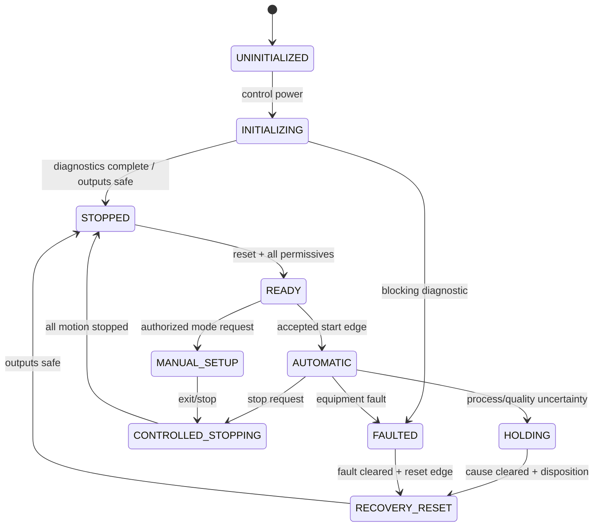

# Machine state and sequence model

> FICTIONAL ENGINEERING PROJECT — NOT FOR CONSTRUCTION

> CONCEPTUAL SAFETY ARCHITECTURE — REQUIRES PROJECT-SPECIFIC RISK ASSESSMENT, DESIGN, VERIFICATION AND VALIDATION BY A QUALIFIED MACHINERY-SAFETY ENGINEER. NO PERFORMANCE LEVEL, SIL, CATEGORY, CE CONFORMITY OR REGULATORY COMPLIANCE IS CLAIMED.

Automatic sequence: index → verify pair → stop conveyor → close gate → engage clamp → validate feedback → zero two counter channels → start pump → open each valve → close each independently at target → stop pump after both closed → drip settle → request inspection with new ID → accept only a fresh valid result → request capper → wait busy/complete → release clamp/gate and return to indexing. Every timeout names the owning module and first-out diagnostic.
