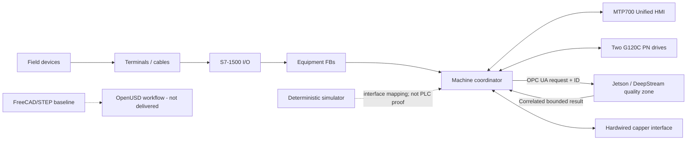

# System architecture

> FICTIONAL ENGINEERING PROJECT — NOT FOR CONSTRUCTION

> CONCEPTUAL SAFETY ARCHITECTURE — REQUIRES PROJECT-SPECIFIC RISK ASSESSMENT, DESIGN, VERIFICATION AND VALIDATION BY A QUALIFIED MACHINERY-SAFETY ENGINEER. NO PERFORMANCE LEVEL, SIL, CATEGORY, CE CONFORMITY OR REGULATORY COMPLIANCE IS CLAIMED.

The PLC owns sequence, command arbitration, timeouts and final transfer permission. The vision edge owns image acquisition/inference only. The HMI cannot write physical outputs; it issues permission-controlled commands with sequence numbers and receives accepted/rejected feedback plus disabled reasons.

### Network zones

- VLAN 10 cell control: PLC, HMI and drives; no direct enterprise ingress.
- VLAN 20 quality/vision: Jetson and camera; routed to PLC through an allow-listed OPC UA policy.
- VLAN 99 temporary engineering: disabled/isolated in production; time-bounded service access.
- Backups, model updates and logs traverse an authenticated maintenance workflow, never an uncontrolled share.
